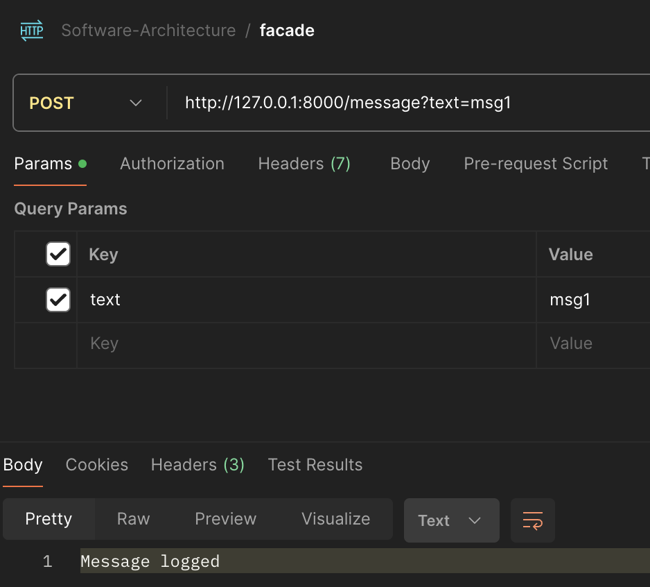
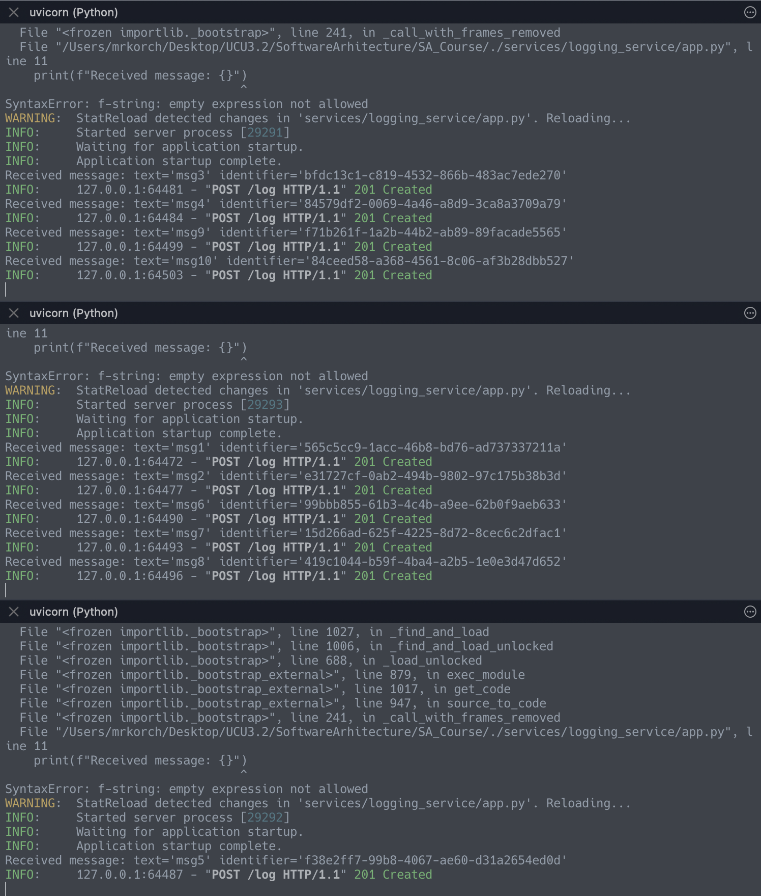
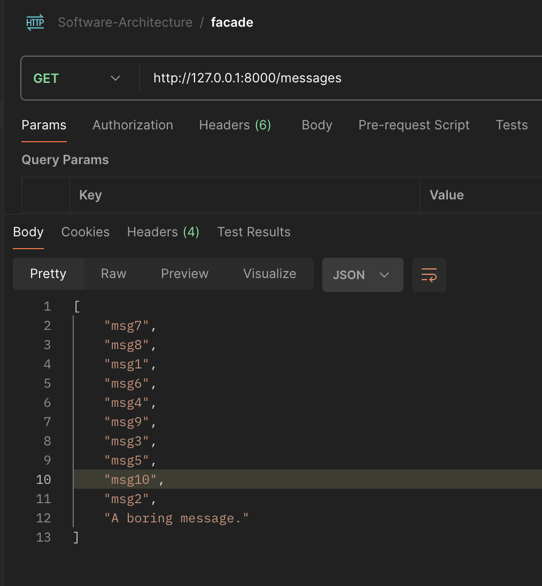

# Starting the services
The presented endpoints are declared [here](./services/endpoints.py).
### Facade Service
```bash
uvicorn services.facade_service.app:app --reload --port 8000
```
### Message Service
```bash
uvicorn services.message_service.app:app --reload --port 8181
```
### Logging Services
First, ensure the Hazelcast server is up. I created 3 nodes locally with:
```
hz start
```
... by running the command in different terminal windows.

Now, start 3 logging services:
```bash
uvicorn  services.facade_service.app:app --reload --port 8980
```

```bash
uvicorn  services.facade_service.app:app --reload --port 8981
```

```bash
uvicorn  services.facade_service.app:app --reload --port 8982
```

We are ready to publish the 10 messages in format `msg{i}`:

___
Here is the result from different logging services:

We see that every service was able to connect to hazelcast cluster and save a message.

Here is the result of `GET` request:

The last message is from the `message-service`.

## Testing
I killed 2 logging services and saw that sometimes the GET/POST request can not performed. Of course, this is because the randomly chosen endpoint has ceased to exist.


### That's it!