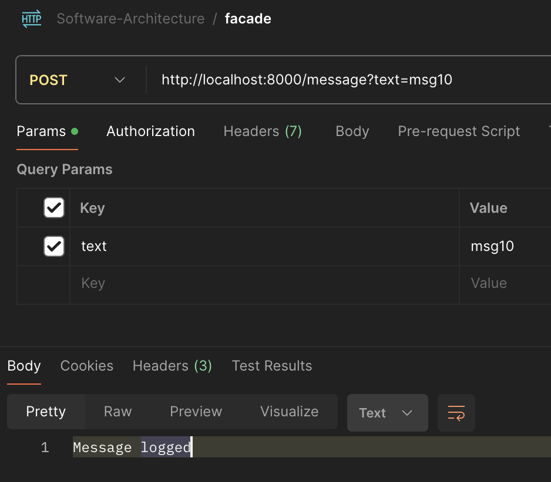
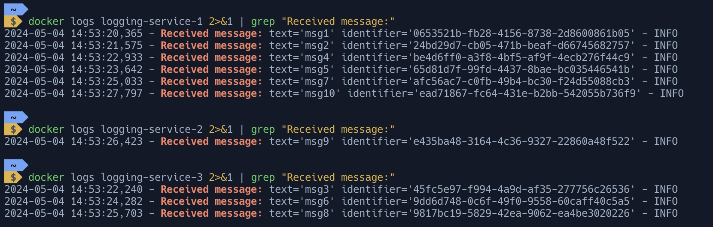
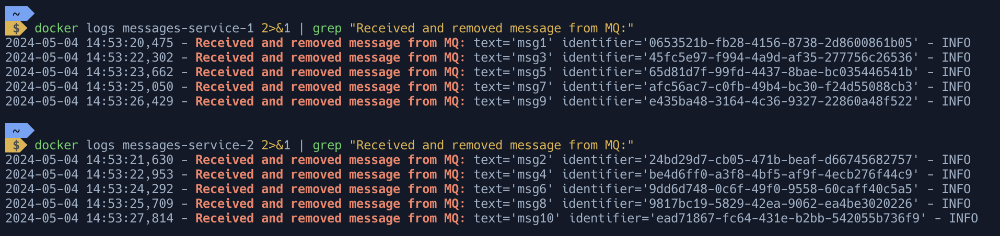
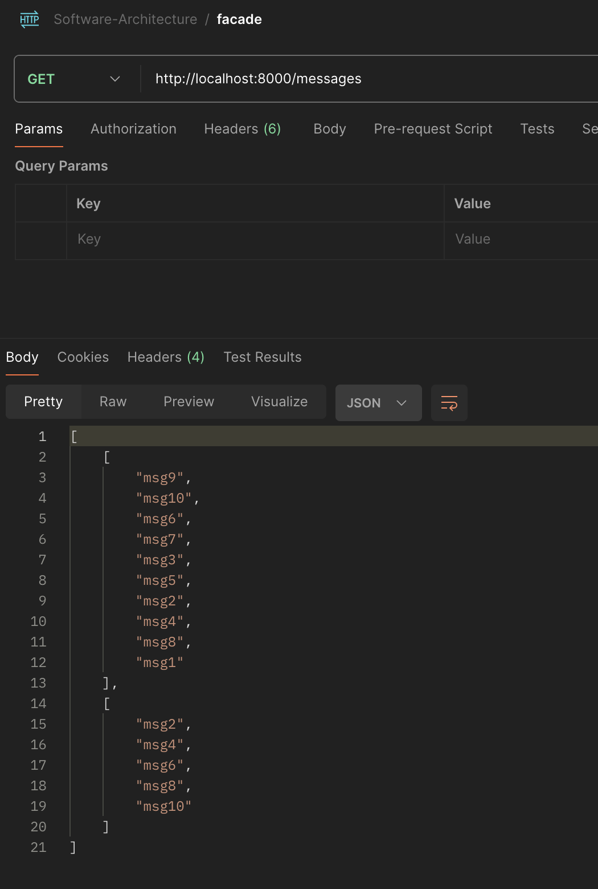
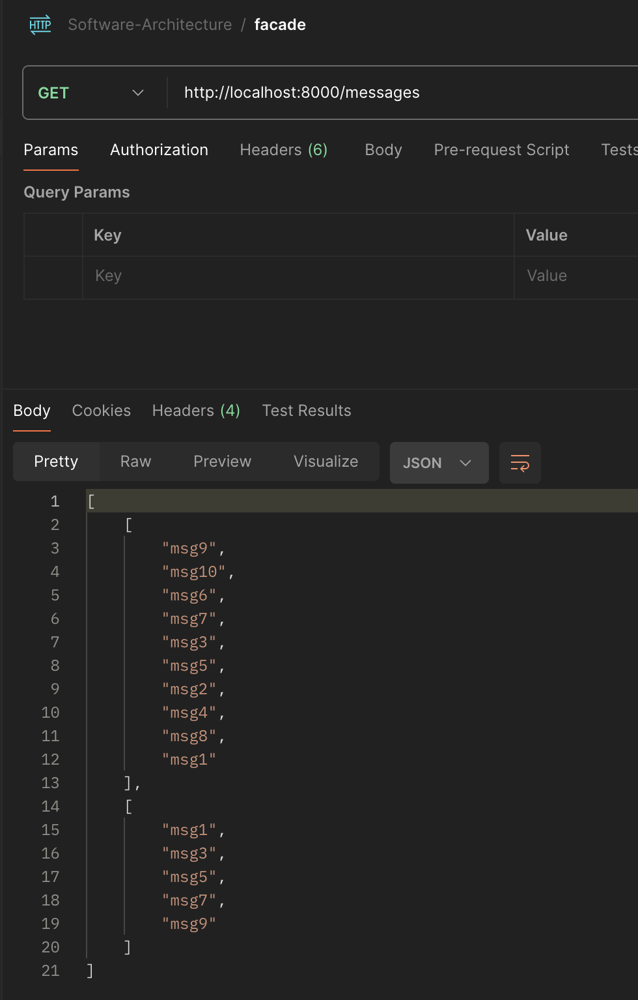

# Adding Messaging Queue between Facade and Messages services
First, set an environment variable `HOST_IP` to your IP address:
```shell
export HOST_IP=$(ifconfig en0 | awk '/inet /{print $2}')  # macOS
export HOST_IP=$(hostname -I | awk '{print $1}')  # Linux
```
Start all the services with:
```bash
docker-compose up -d
```

### Facade Service Logic
- `POST` endpoint sends the message to a logging service and to 1 random messages service.
	- The message and Facade services are connected via Messaging Queue via Hazelcast.
	- A random message service instance picks up the item from the queue and saves it.
- `GET` endpoint reads all logged messages from the logging service and in-memory messages from 1 of the messages services.
	- 2 lists are returned: all the logged messages and those stored in-memory.
### Messaging Queue Consumption
A separate thread is started [here](./services/messaging_queue/mq_consumer.py#L26) to free up the main process from something more important.
An in-memory mapping has an associated lock to ensure thread-safety. The lock is used when the new item is encountered or the saved messages have been requested.

### `docker-compose` comments
2 networks are created for different Hazelcast clusters:
- for all messages logging;
- for messaging queue.
Service ports are accessed through environment variables to allow adaptability.
## Testing
### Posting 10 messages `msg{i}`

### Logs received by Logging services

### Messages received by Messaging Services

### Combining `GET` Requests

<table>
  <tr>
    <td>
      
    </td>
    <td>
      
    </td>
  </tr>
</table>

We see that all logged messages were retrieved every time, and that the union of two requests for the messaging service also results in all the sent messages.
## Cleanup

```bash
unset HOST_IP
docker-compose down --rmi local
docker rmi facade-service messages-service logging-service
```