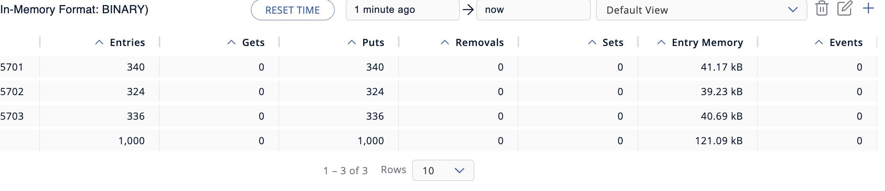
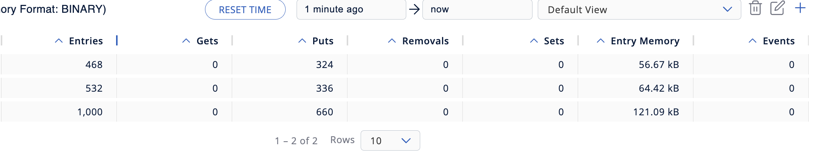
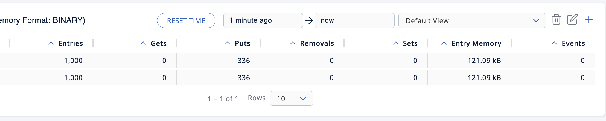
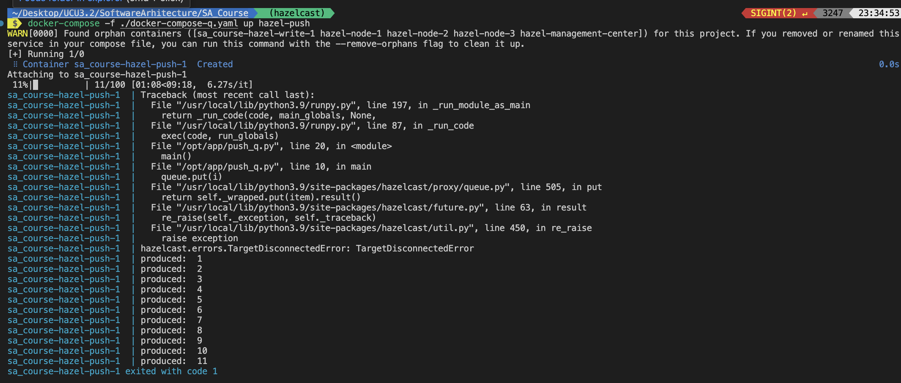
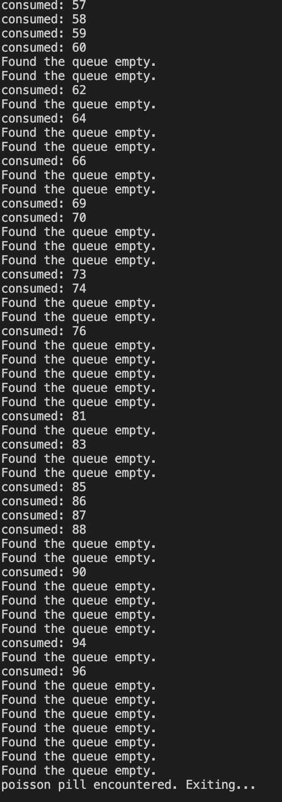
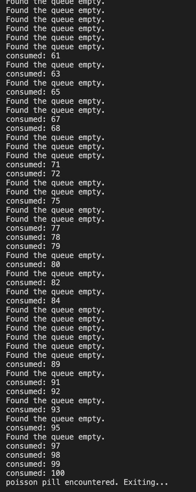

# Hazelcast Basics

## Starting a Hazelcast Cluster

First, set an environment variable `HOST_IP` to your IP address:

```shell
export HOST_IP=$(ifconfig en0 | awk '/inet /{print $2}')  # macOS
export HOST_IP=$(hostname -I | awk '{print $1}')  # Linux
```

Start $3$ nodes in $1$ cluster and a hazelcast management center:

```shell
docker-compose up -d
```

## Writing into the distributed map

```shell
docker build hazelcast_communication -f hazelcast_communication/Dockerfile-write -t hazel-write:1.0
docker run --rm -e HOST_IP=${HOST_IP} --network hazelcast-network --name hazel-write hazel-write:1.0
```

Verifying this in the Hazelcast Management Center (open `http://localhost:8080`):


We see that the entries dsitribution is almost uniform.

### Deleting node-1

```shell
docker stop hazel-node-1
```

We observe that the entries are redistributed to the remaining nodes:


### Deleting node-2

```shell
docker stop hazel-node-2
```

All the entries redistributed to the remaining node:


This happened because there was enough time for data migration between two consecutive node deletions. If one were to interrupt the data migration process, the data would have been lost.

## Map Increment using $3$ different methods

At each stage the same code snippet is run:

```shell
docker-compose -f ./docker-compose-increment.yaml up --scale hazel-increment=3
```

Only the `HAZEL_LOCK` environment variable is changed.

### $1$. Simple Increment with no locks

This is of course not process-safe as different processes may read the value while it is being updated. We almost surely get a wrong result:

```shell
export HAZEL_LOCK=0
```

The increments took each process $46$ seconds.


### 2. Pessimistic Lock

We use a lock to ensure that only one process can read and update the value at a time. This is process-safe. It is not very efficient but is easy-to-use and understand.

```shell
export HAZEL_LOCK=1
```

The increments took each process $3$ minutes $30$ seconds. We see that using the lock did indeed affect the performance significantly.


### 3. Optimistic Lock

```shell
export HAZEL_LOCK=2
```

The optimistic lock turned out to be more efficient and increment's output is identical to the previous step. This is expected because for we do not handle locks and make use of CAS (compare-and-swap) operation only.

## Bounded queue usage

I copied the existin config of hazelcast cluster at `/opt/hazelcast/config/hazelcast-docker.xml`, which is the defaul location for a docker hazelcast container.

I modifed it [here](./hazelcast.xml#L213) and set the max queue size from $0$(which denotes an unbounded queue) to $10$.
I mapped this config file to necessary containers.

Let's first start a producer:

```shell
docker-compose -f ./docker-compose-q up hazel-push --build
```

One sees in the output:


Let's add two consumers:

```shell
docker-compose -f docker-compose-q.yaml up --build --scale hazel-read=2
```

Let's examine their logs:





I added poisson pill that is added back to the queue after being encountered so that other consumers could also see it.
We also see that sometimes the queue is empty and the consumers are waiting for the producer to produce more items.

This makes sense because we have more consumers than producers.

## Clean Up

If you were to use the examples above, you might want to clean up:

```
docker rmi
```
