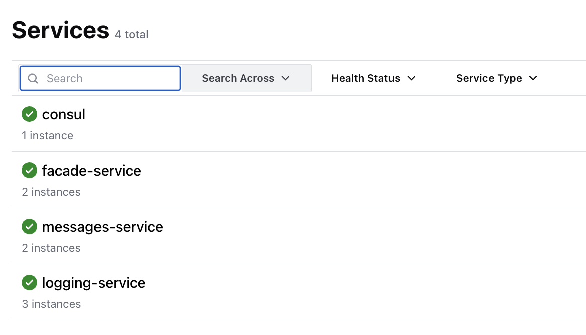
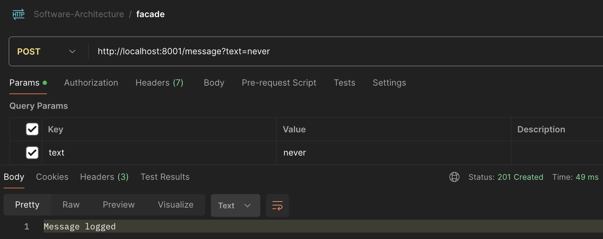
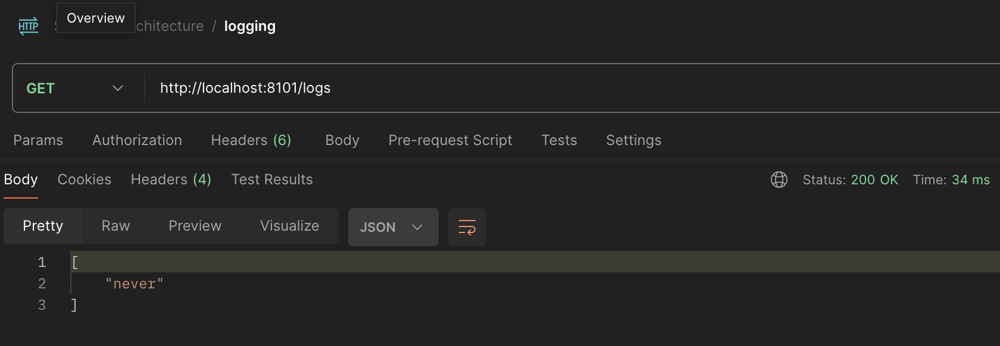
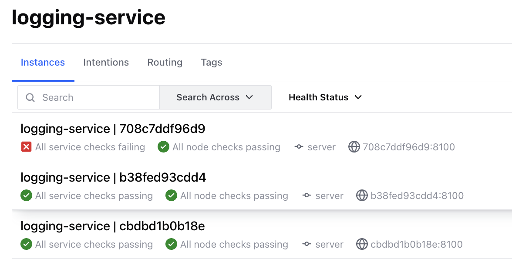
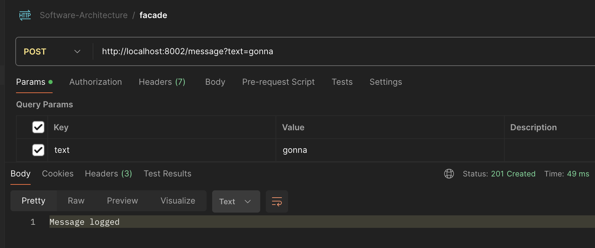
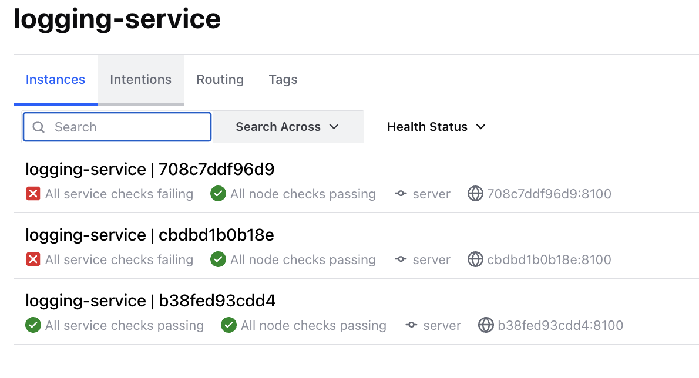
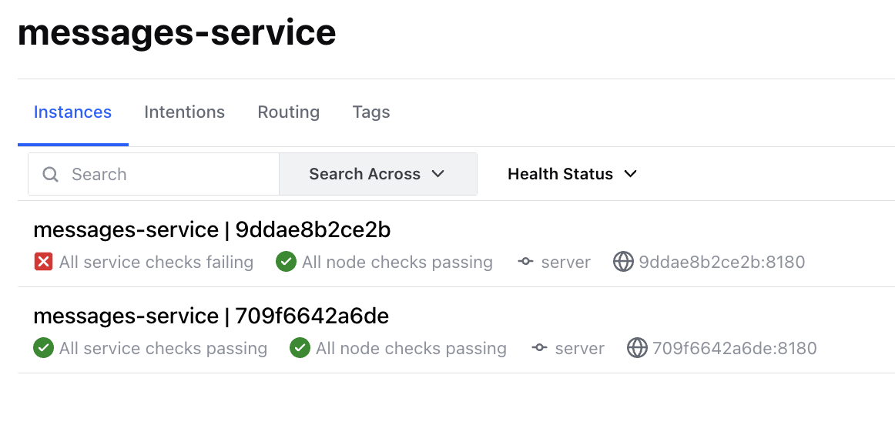
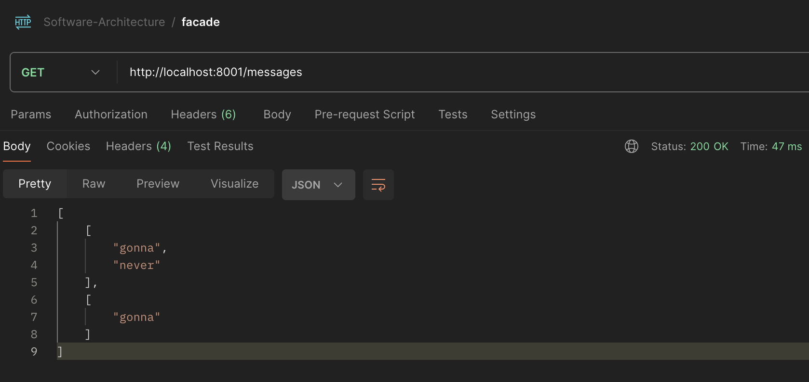

# Consul for Service Discovery and Config Server

Start all the services with:
```bash
docker-compose up -d
```
## Motivation
Messaging and Logging services are implemented so that they can be easily scaled horizontally.
Also, the number of services may vary for different load or because of networking issues.

The services that rely on such dynamic service instances need a robust way to get the currently healthy endpoints to use them.

Consul solves this problem. Whenever the service is created, it registers itself in the services registry. From time to time Consul checks whether the registered services are still healthy by running a quick health check. I used REST API for this.

Consul allows to store Key-Value (KV) pairs for services configuration. This allows to read the necessary config information rather than hard-code it. For example, Logging service uses a Hazelcast distributed map, which name is saved in KV consul pairs.

Each service is identified based on the [service name](./services/service_names.py) and its hostname.

## Consul service implementation | Python
The consul interactions are stored [here](./services/consul_service). Consul connection, KV lookup, service discovery, and service registration are defined there.
Every service uses this API.

## Consul service implementation | Docker
The [population script](consul-population.sh) is run at the start of consul service. It waits until the consul has initialized, populates KV dictionary, and then puts `CONSUL_ESSENTIAL_KEY` to let other services know that the population has completed. From now on, the service is considered **healthy** and this is marked in [`docker-compose`](./docker-compose.yaml#L218).

## Services scaling
Each service instance shares common attributes used for its definition. This simplifies horizontal service scaling. [An example](./docker-compose.yaml#L40).
Each out of 3 services can be scaled this way. Current [docker-compose](./docker-compose.yaml) contains 2 instances of Facade service, 3 instances of Logging service, and 2 instances of messaging service.


## Robustness Verification
Here, we explore how Consul handles the sudden disappearance of containers.
Consul web UI after all services have been started:

Let's add 1 message to first Facade instance:

Facade service logs:
```bash
2024-05-07 16:35:28,525 - INFO - Extracted URLs: ['http://708c7ddf96d9:8100', 'http://b38fed93cdd4:8100', 'http://cbdbd1b0b18e:8100']
2024-05-07 16:35:28,525 - INFO - Logging URL chosen: http://b38fed93cdd4:8100
2024-05-07 16:35:28,669 - INFO - Message {'identifier': 'c8ef43c2-823e-4121-880a-646abc712790', 'text': 'never'} sent to MQ
INFO:     172.27.0.1:64022 - "POST /message?text=never HTTP/1.1" 201 Created
```
We can check whether the Logging services saved it:

___
Now, we can kill 1 container with:
```bash
docker container kill logging-service-1
```
Consul web UI shows:

Let's log 1 more message:

Facade logs:
```bash
2024-05-07 16:37:56,149 - INFO - Extracted URLs: ['http://cbdbd1b0b18e:8100', 'http://b38fed93cdd4:8100']
2024-05-07 16:37:56,149 - INFO - Logging URL chosen: http://b38fed93cdd4:8100
2024-05-07 16:37:56,174 - INFO - Message {'identifier': '48519195-9739-4b49-9d79-210415f5dee3', 'text': 'gonna'} sent to MQ
INFO:     172.27.0.1:56048 - "POST /message?text=gonna HTTP/1.1" 201 Created
```
We see that now only 2 URLs were discovered, which means unhealthy service was not considered.
We can kill 2 more services:
```bash
docker container kill logging-service-2
docker container kill messages-service-2
```


Finally, lets retrieve the logged messages:

Facade console logs:
```bash
2024-05-07 16:41:47,593 - INFO - Extracted URLs: ['http://709f6642a6de:8180']
2024-05-07 16:41:47,606 - INFO - Extracted URLs: ['http://b38fed93cdd4:8100']
```
Only 1 URL was discovered because other services were removed.


## Cleanup

```bash
docker-compose down
docker rmi facade-service messages-service logging-service
```